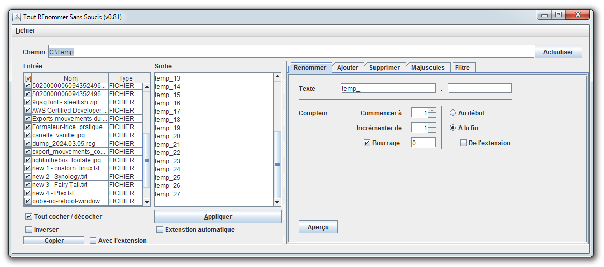
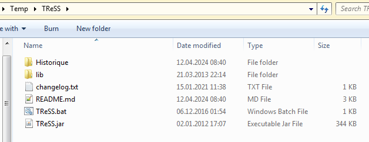
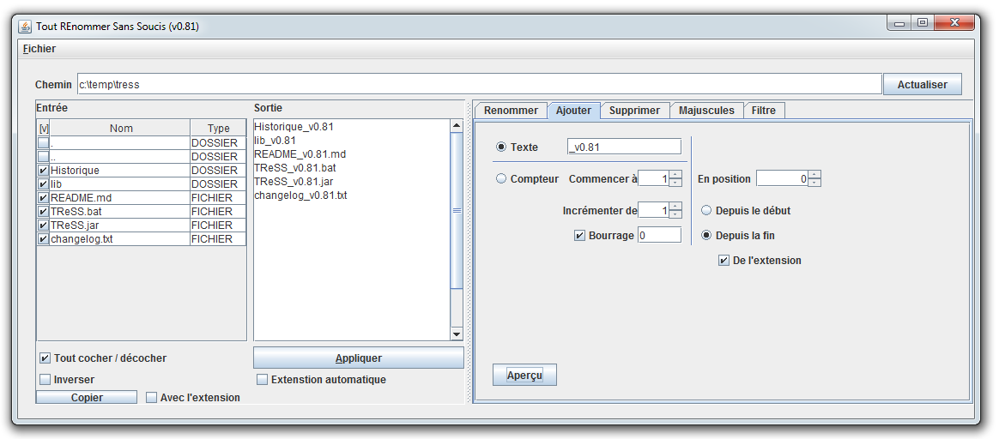
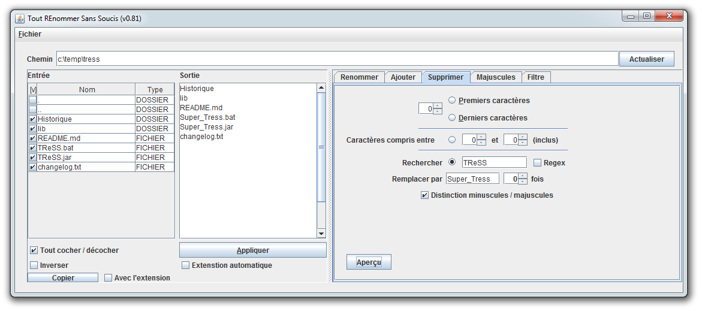
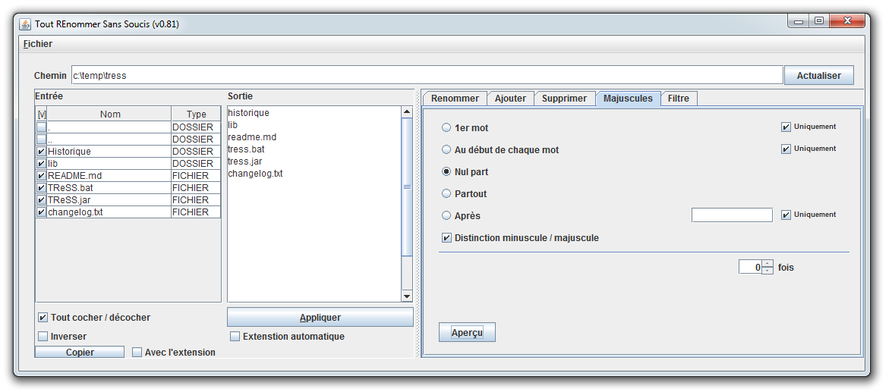
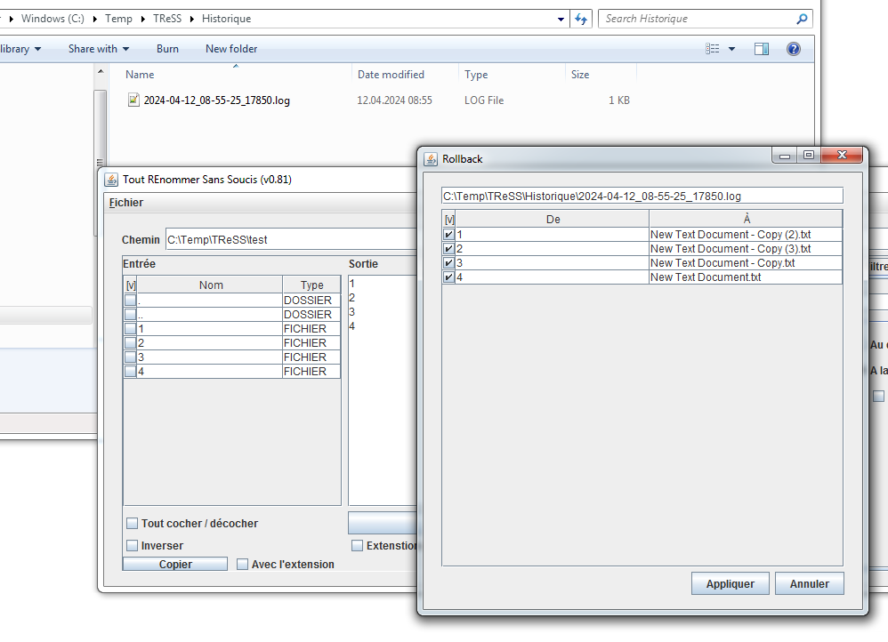

# TReSS (v0.8.1)



## Installation

Dézippez tout les fichiers dans un dossier, vous devez avoir :

- Historique
- lib
  - forms-1.3.0pre4.jar
- TReSS_X.Y.jar
- [ReadMe.md]
- [changelog.txt]



Téléchargez et installez une JVM 1.6 minimum (par exemple ici [Java.com](http://www.java.com/fr/download/))

Double-cliquez sur TReSS_X.Y.jar ou exécutez la commande : 

```
java -jar TReSS_X.Y.jar
```

En remplaçant X.Y par le numéro de version.

## Liste des fonctionnalités "cachées"

### Chemin

Le chemin du dossier lu apparaît dans la zone de texte en haut. Il est possible d’entrer manuellement un chemin pour qu’il soit lu.

Au lancement du programme, si un chemin de dossier est présent dans le presse-papier, le programme va le lire.

### Filtre (Afficher / Masquer)

Il est possible d’utiliser simultanément les deux filtres, dans cet ordre uniquement. Cela signifie que sur la liste des dossiers présent dans le dossier lu, le programme ne garde que ceux qui correspondent au filtre "Afficher" puis – de ceux-là – masque ceux qui correspondent au filtre "Masquer".

Vous pouvez rentrer plusieurs critères de sélection séparés par des slashs "/". (Il en va de même pour la zone de texte nommée "Après" sous l’option "Majuscules")

### Actualiser

Le bouton Actualiser rafraîchit le dossier lu en le lisant à nouveau. Donc les changements apportés extérieurement au programme seront pris en compte. Un simple clic dans la barre du chemin fait pareil.

### Appliquer

Applique aux fichiers ou aux dossiers lus les changements effectués dont le résultat apparaît dans la zone nommée "Sortie". Il est donc possible de faire une modification manuelle dans la zone "Sortie" après avoir lancé un aperçu.

### Extension automatique

Si cette case est cochée, les fichiers garderont leur extension actuelle. Si l’aperçu affiche "text.zip" comme nouveau nom pour le fichier "text.txt", le résultat sera "text.zip.txt"

### Info-bulle

De nombreuses info-bulles (tool-tip text) sont disponibles en laissant la souris posée sur les composants. Certains plus utiles que d’autres.

## Les différents écrans et fonctions

### Renommer
Renomme complètement chaque fichier, avec un compteur


### Ajouter
Ajoute du texte à chaque fichier.
Au début, à la fin, au milieu, en prennant en compte l'extension du fichier ou pas, à choix


### Supprimer
Supprime une portion de texte.
Soit un nombre de caractères fixes, soit avec une fonction rechercher/remplacer.
Supporte les regex et fait la distinction minuscule/majuscule, à choix.


### Majuscule / Minuscule
Uniformise les minuscules/majuscules


### Rollback

Un système de rollback est en place, chaque renommage génère un fichier de log avec tous les fichiers concernés.
Il est possible de revenir à la situation précédente en un clic, si les fichiers n'ont pas été supprimés (ces derniers apparaissent en rouge dans l'interface).

